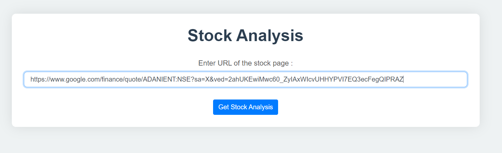

# Stock Analysis Website

This project is a web-based tool that provides stock analysis by scraping data from stock-related web pages. The website uses the Firecrawl SDK to scrape content from a given URL and employs the Gemini API to analyze the scraped content, providing insights into stock performance and market trends.

## Features

- **Scrape Stock Data**: Utilizes the Firecrawl SDK to extract relevant content from stock page URLs provided by the user.
- **Stock Analysis**: Uses the Gemini API to perform a detailed analysis of the scraped content, generating a summary of the stock's performance and highlighting key points.
- **User-Friendly Interface**: Provides a simple and intuitive interface for users to input URLs and view analysis results.
- **Responsive Design**: The website design is fully responsive, ensuring a seamless experience on both desktop and mobile devices.

## Technologies Used

- **Firecrawl SDK**: For scraping stock-related content from specified URLs.
- **Gemini API**: For analyzing the scraped content and generating stock analysis reports.
- **Python**: The core programming language used for backend development and integrating Firecrawl and Gemini.
- **Flask**: A lightweight WSGI web application framework used to build the backend and serve the web pages.
- **HTML/CSS/JavaScript**: For frontend development, providing a modern and responsive user interface.

## How the Website Looks

Below are screenshots showing different parts of the website:

*Home page with input form for stock page URL.*

*Stock analysis results displayed after scraping and processing.*